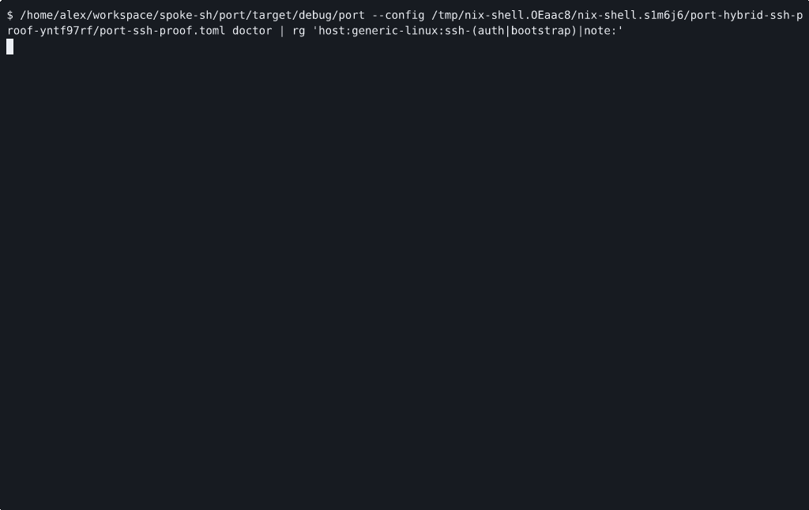

# VOYAGE REPORT: SSH-First Hybrid Execution Foundations

## Voyage Metadata
- **ID:** VDeuazAgk
- **Epic:** VDcStPolu
- **Status:** done
- **Goal:** -

## Execution Summary
**Progress:** 4/4 stories complete

## Implementation Narrative
### Add SSH Remote Doctor Guidance
- **ID:** VDeuzX5cO
- **Status:** done

#### Summary
Teach `port doctor` and adjacent CLI guidance to distinguish SSH remote-host
readiness, auth material, and bootstrap expectations from the existing local
and hosted lanes.

#### Acceptance Criteria
- [x] [SRS-02/AC-01] `port doctor` surfaces SSH remote-host prerequisites, auth material, and bootstrap requirements separately from local-host and hosted-control-plane checks. <!-- [SRS-02/AC-01] verify: bash -lc 'cd /home/alex/workspace/spoke-sh/port && cargo test -q doctor_ssh_remote_guidance', proof: ac-1.log -->
- [x] [SRS-NFR-01/AC-02] Misconfigured SSH targets fail with explicit route, host, provider, and ownership guidance rather than vague remote errors or local fallback. <!-- [SRS-NFR-01/AC-02] verify: bash -lc 'cd /home/alex/workspace/spoke-sh/port && cargo test -q doctor_ssh_remote_failure_guidance', proof: ac-2.log -->

#### Verified Evidence
- [ac-1.log](../../../../stories/VDeuzX5cO/EVIDENCE/ac-1.log)
- [ac-2.log](../../../../stories/VDeuzX5cO/EVIDENCE/ac-2.log)

### Implement SSH Machine Lifecycle Routing
- **ID:** VDeuzYscv
- **Status:** done

#### Summary
Implement the first bounded SSH-first machine lifecycle path so canonical
`launch`, `status`, and `stop` verbs can target a remote Linux host without
forking the CLI or hiding route ownership.

#### Acceptance Criteria
- [x] [SRS-03/AC-01] `port machine launch`, `status`, and `stop` route through an SSH-managed remote Linux host for the first supported lifecycle slice. <!-- [SRS-03/AC-01] verify: cargo test -q --test machine_commands cli_ssh_machine_launch_status_and_stop_round_trip, proof: ac-1.log -->
- [x] [SRS-04/AC-02] SSH lifecycle output and failure paths keep machine, host, provider, route, and ownership context explicit. <!-- [SRS-04/AC-02] verify: cargo test -q --test machine_commands cli_ssh_machine_route_context, proof: ac-2.log -->

#### Verified Evidence
- [ac-1.log](../../../../stories/VDeuzYscv/EVIDENCE/ac-1.log)
- [ac-2.log](../../../../stories/VDeuzYscv/EVIDENCE/ac-2.log)

### Publish Hybrid Execution Operator Proof
- **ID:** VDeuzbve3
- **Status:** done

#### Summary
Publish the hybrid local, hosted, and SSH operator contract in docs and record
the first human-reviewable proof artifact for the SSH-first workflow.

#### Acceptance Criteria
- [x] [SRS-05/AC-01] The canonical docs publish the hybrid execution contract and the first SSH-first operator workflow without inventing a second command family. <!-- [SRS-05/AC-01] verify: bash -lc 'cd /home/alex/workspace/spoke-sh/port && rg -n "ssh|hosted-control-plane|hybrid" README.md docs CONFIGURATION.md', proof: ac-1.log -->
- [x] [SRS-NFR-03/AC-02] The story records at least one human-reviewable proof artifact through the proof system for the SSH-first workflow. <!-- [SRS-NFR-03/AC-02] verify: bash -lc 'cd /home/alex/workspace/spoke-sh/port && ./scripts/render-hybrid-ssh-proof.sh .keel/stories/VDeuzbve3/EVIDENCE', proof: ac-2.gif -->

#### Verified Evidence
- [ac-1.log](../../../../stories/VDeuzbve3/EVIDENCE/ac-1.log)

- [ac-2.log](../../../../stories/VDeuzbve3/EVIDENCE/ac-2.log)
- [hybrid-ssh-workflow.cast](../../../../stories/VDeuzbve3/EVIDENCE/hybrid-ssh-workflow.cast)

### Introduce SSH Hybrid Route Contract
- **ID:** VDeuzcDcL
- **Status:** done

#### Summary
Extend the Port host-connection and route vocabulary so SSH-managed remote
Linux hosts are first-class alongside the existing local and hosted-control-
plane lanes.

#### Acceptance Criteria
- [x] [SRS-01/AC-01] The model and config surfaces add an explicit SSH-managed host connection contract without replacing the current `local` and `hosted-control-plane` paths. <!-- [SRS-01/AC-01] verify: bash -lc 'cd /home/alex/workspace/spoke-sh/port && cargo test -q ssh_host_connection_contract', proof: ac-1.log -->
- [x] [SRS-NFR-02/AC-02] Existing local and hosted route semantics remain covered after the SSH lane is introduced. <!-- [SRS-NFR-02/AC-02] verify: bash -lc 'cd /home/alex/workspace/spoke-sh/port && cargo test -q hybrid_route_regression_local_and_hosted', proof: ac-2.log -->

#### Verified Evidence
- [ac-1.log](../../../../stories/VDeuzcDcL/EVIDENCE/ac-1.log)
- [ac-2.log](../../../../stories/VDeuzcDcL/EVIDENCE/ac-2.log)

