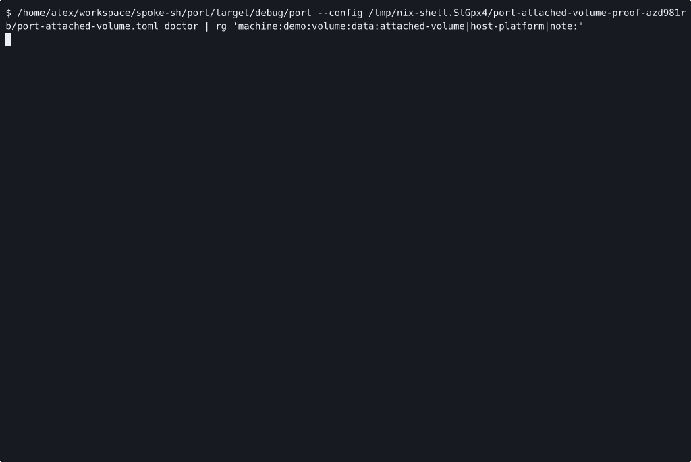

# VOYAGE REPORT: Attached Volume Contract Foundations

## Voyage Metadata
- **ID:** VDfEyGkVf
- **Epic:** VDcStQqlo
- **Status:** done
- **Goal:** -

## Execution Summary
**Progress:** 4/4 stories complete

## Implementation Narrative
### Add Attached Volume Lane Guidance
- **ID:** VDfF1cZOD
- **Status:** done

#### Summary
Surface attached-volume readiness, backing, and lane-support guidance so
operators can tell whether a machine can attach a declared volume before
launching it.

#### Acceptance Criteria
- [x] [SRS-04/AC-01] `port doctor`, validation, and operator docs keep attached-volume backend, host-path, machine, and ownership detail explicit instead of collapsing the storage contract back into rootfs language. <!-- [SRS-04/AC-01] verify: sh -c 'cd /home/alex/workspace/spoke-sh/port && cargo test -q doctor_attached_volume_guidance && /home/alex/.nix-profile/bin/rg -n "attached volume|host-file|host path|ownership" README.md docs CONFIGURATION.md', proof: ac-1.log -->
- [x] [SRS-NFR-01/AC-02] Hosted and SSH-owned machines that declare attached volumes fail fast with explicit machine, lane, and backing guidance instead of silently ignoring or rerouting the request. <!-- [SRS-NFR-01/AC-02] verify: cargo test -q attached_volume_unsupported_lane_guidance, proof: ac-2.log -->

#### Verified Evidence
- [ac-1.log](../../../../stories/VDfF1cZOD/EVIDENCE/ac-1.log)
- [ac-2.log](../../../../stories/VDfF1cZOD/EVIDENCE/ac-2.log)

### Implement Local Attached Volume Launch Path
- **ID:** VDfF1csOC
- **Status:** done

#### Summary
Implement the first attached-volume runtime slice by routing one declared
non-root block volume through the direct local machine lifecycle path and
projecting explicit attachment context in output and runtime state.

#### Acceptance Criteria
- [x] [SRS-02/AC-01] Direct local `machine launch`, `status`, and `stop` attach one declared non-root volume through the supported local Firecracker launcher path and keep the attachment visible in runtime state. <!-- [SRS-02/AC-01] verify: cargo test -q -p port-cli cli_machine_launch_status_and_stop_with_attached_volume, proof: ac-1.log -->
- [x] [SRS-03/AC-02] CLI success and failure surfaces keep backend, host path, machine, and ownership context explicit for machines with attached volumes. <!-- [SRS-03/AC-02] verify: cargo test -q -p port-cli cli_attached_volume_route_context, proof: ac-2.log -->
- [x] [SRS-NFR-02/AC-03] Existing attachment-free local machine workflows remain green after the attached-volume runtime path lands. <!-- [SRS-NFR-02/AC-03] verify: cargo test -q -p port-cli cli_machine_launch_status_and_stop_round_trip, proof: ac-3.log -->

#### Verified Evidence
- [ac-1.log](../../../../stories/VDfF1csOC/EVIDENCE/ac-1.log)
- [ac-2.log](../../../../stories/VDfF1csOC/EVIDENCE/ac-2.log)
- [ac-3.log](../../../../stories/VDfF1csOC/EVIDENCE/ac-3.log)

### Publish Attached Volume Operator Proof
- **ID:** VDfF1dVOF
- **Status:** done

#### Summary
Publish the canonical attached-volume operator workflow in docs and record a
human-reviewable proof artifact for mission and story review.

#### Acceptance Criteria
- [x] [SRS-05/AC-01] The canonical docs publish the attached-volume contract and the first direct-runtime operator workflow without inventing a second storage command family. <!-- [SRS-05/AC-01] verify: sh -c 'cd /home/alex/workspace/spoke-sh/port && /home/alex/.nix-profile/bin/rg -n "volume|attachment|storage" README.md docs CONFIGURATION.md', proof: ac-1.log -->
- [x] [SRS-NFR-03/AC-02] The story records at least one human-reviewable proof artifact through the proof system for the attached-volume workflow. <!-- [SRS-NFR-03/AC-02] verify: sh -c 'cd /home/alex/workspace/spoke-sh/port && ./scripts/render-attached-volume-proof.sh .keel/stories/VDfF1dVOF/EVIDENCE', proof: ac-2.gif -->

#### Verified Evidence
- [ac-1.log](../../../../stories/VDfF1dVOF/EVIDENCE/ac-1.log)

- [ac-2.log](../../../../stories/VDfF1dVOF/EVIDENCE/ac-2.log)
- [attached-volume-workflow.cast](../../../../stories/VDfF1dVOF/EVIDENCE/attached-volume-workflow.cast)

### Introduce Canonical Volume And Attachment Model
- **ID:** VDfF1dZM9
- **Status:** done

#### Summary
Add a canonical attached-volume contract to the Port model so machines can
declare non-root block-volume attachments without overloading the existing
`guest_image` rootfs artifact path.

#### Acceptance Criteria
- [x] [SRS-01/AC-01] The model and config surfaces add explicit machine-level attached-volume declarations without replacing the current `guest_image` and `rootfs_read_only` contract. <!-- [SRS-01/AC-01] verify: cargo test -q -p port-model volume_attachment_contract, proof: ac-1.log -->
- [x] [SRS-NFR-02/AC-02] Existing machines that declare no attachments preserve the current machine contract and validation behavior after the new model lands. <!-- [SRS-NFR-02/AC-02] verify: cargo test -q -p port-model machine_contract_without_attachments_regression, proof: ac-2.log -->

#### Verified Evidence
- [ac-1.log](../../../../stories/VDfF1dZM9/EVIDENCE/ac-1.log)
- [ac-2.log](../../../../stories/VDfF1dZM9/EVIDENCE/ac-2.log)

