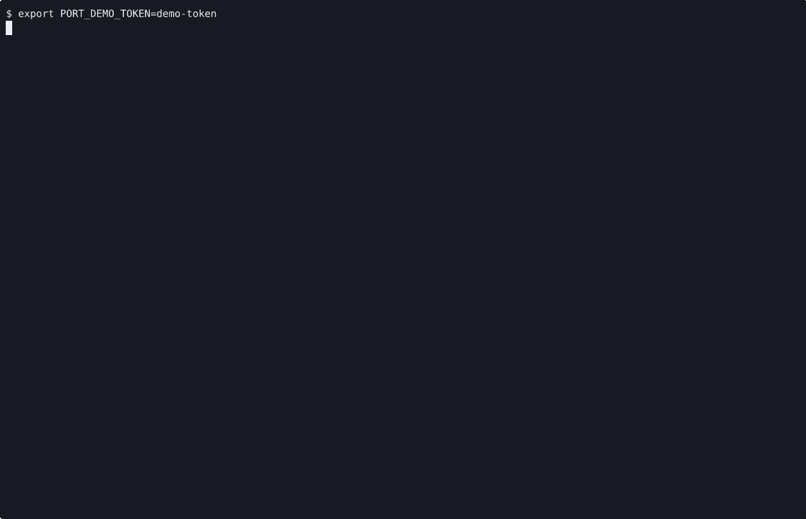

# VOYAGE REPORT: Hosted Stateless K3s Foundations

## Voyage Metadata
- **ID:** VDfytSpPs
- **Epic:** VDcStSMlp
- **Status:** done
- **Goal:** -

## Execution Summary
**Progress:** 4/4 stories complete

## Implementation Narrative
### Introduce Hosted K3s Cluster Contract
- **ID:** VDfzLrZ4e
- **Status:** done

#### Summary
Add the first explicit hosted K3s cluster contract so Port can describe one
hosted-control-plane cluster in terms of an existing control plane, one host
group, one server machine, and one or more worker machines without replacing
the current machine and guest model.

#### Acceptance Criteria
- [x] [SRS-01/AC-01] The model and config surfaces add a canonical hosted K3s cluster contract that binds one control plane, one host group, one server machine, one or more worker machines, and first-slice bootstrap metadata. <!-- [SRS-01/AC-01] verify: cargo test -q -p port-model hosted_k3s_cluster_contract, proof: ac-1.log -->
- [x] [SRS-NFR-02/AC-02] Existing hosted machine, guest, service, local, and SSH contracts remain valid for configs that do not declare a K3s cluster. <!-- [SRS-NFR-02/AC-02] verify: cargo test -q -p port-model hosted_k3s_cluster_contract_regression_existing_routes, proof: ac-2.log -->

#### Verified Evidence
- [ac-1.log](../../../../stories/VDfzLrZ4e/EVIDENCE/ac-1.log)
- [ac-2.log](../../../../stories/VDfzLrZ4e/EVIDENCE/ac-2.log)

### Add Hosted K3s Access And Boundary Surfaces
- **ID:** VDfzOEdFM
- **Status:** done

#### Summary
Surface cluster access, placement detail, and first-slice failure boundaries so
operators can inspect the hosted K3s lane through canonical Port surfaces
without mistaking it for an HA or persistent Kubernetes platform.

#### Acceptance Criteria
- [x] [SRS-03/AC-01] The hosted K3s lane exposes kubeconfig or equivalent cluster access plus node or workload visibility through canonical operator surfaces. <!-- [SRS-03/AC-01] verify: cargo test -q hosted_k3s_cluster_access_contract, proof: ac-1.log -->
- [x] [SRS-04/AC-02] Unsupported hosted K3s requests fail fast with explicit boundary guidance for missing host-group capacity, persistence, HA, ingress, or non-hosted ownership routes. <!-- [SRS-04/AC-02] verify: cargo test -q hosted_k3s_boundary_failures, proof: ac-2.log -->
- [x] [SRS-NFR-01/AC-03] Placement and lifecycle output for hosted K3s keeps control-plane, host-group, candidate-node, selected-node, and rejected-node detail explicit. <!-- [SRS-NFR-01/AC-03] verify: cargo test -q hosted_k3s_route_context_visibility, proof: ac-3.log -->

#### Verified Evidence
- [ac-1.log](../../../../stories/VDfzOEdFM/EVIDENCE/ac-1.log)
- [ac-2.log](../../../../stories/VDfzOEdFM/EVIDENCE/ac-2.log)
- [ac-3.log](../../../../stories/VDfzOEdFM/EVIDENCE/ac-3.log)

### Publish Hosted K3s Operator Proof
- **ID:** VDfzOEeFL
- **Status:** done

#### Summary
Publish the first hosted K3s operator workflow in canonical docs and record a
human-reviewable proof artifact for cluster bring-up and review.

#### Acceptance Criteria
- [x] [SRS-05/AC-01] The canonical docs publish the hosted stateless K3s contract, workflow, and first-slice boundaries without inventing a second Kubernetes-only toolchain. <!-- [SRS-05/AC-01] verify: rg -q 'Hosted Stateless K3s First Slice' /home/alex/workspace/spoke-sh/port/docs/operators.md && rg -q '\[k3s_clusters\.demo\]' /home/alex/workspace/spoke-sh/port/CONFIGURATION.md && rg -q 'hosted stateless K3s workflow' /home/alex/workspace/spoke-sh/port/README.md && printf 'hosted-k3s-docs-ok\n', proof: ac-1.log -->
- [x] [SRS-NFR-03/AC-02] The story records at least one human-reviewable proof artifact through the proof system for the hosted K3s workflow. <!-- [SRS-NFR-03/AC-02] verify: sh -c 'cd /home/alex/workspace/spoke-sh/port && ./scripts/render-hosted-k3s-proof.sh .keel/stories/VDfzOEeFL/EVIDENCE', proof: ac-2.gif -->

#### Verified Evidence
- [ac-1.log](../../../../stories/VDfzOEeFL/EVIDENCE/ac-1.log)

- [hosted-k3s-workflow.cast](../../../../stories/VDfzOEeFL/EVIDENCE/hosted-k3s-workflow.cast)

### Implement Hosted K3s Bootstrap And Join Workflow
- **ID:** VDfzOEtFN
- **Status:** done

#### Summary
Implement the first hosted K3s bootstrap workflow so Port can bring up one K3s
server node, join at least one worker node, and keep that lifecycle on the
canonical hosted machine and guest path.

#### Acceptance Criteria
- [x] [SRS-02/AC-01] The hosted K3s workflow bootstraps one server machine and joins at least one worker machine through canonical machine lifecycle and guest-control surfaces. <!-- [SRS-02/AC-01] verify: cargo test -q hosted_k3s_bootstrap_and_join_workflow, proof: ac-1.log -->

#### Verified Evidence
- [ac-1.log](../../../../stories/VDfzOEtFN/EVIDENCE/ac-1.log)

