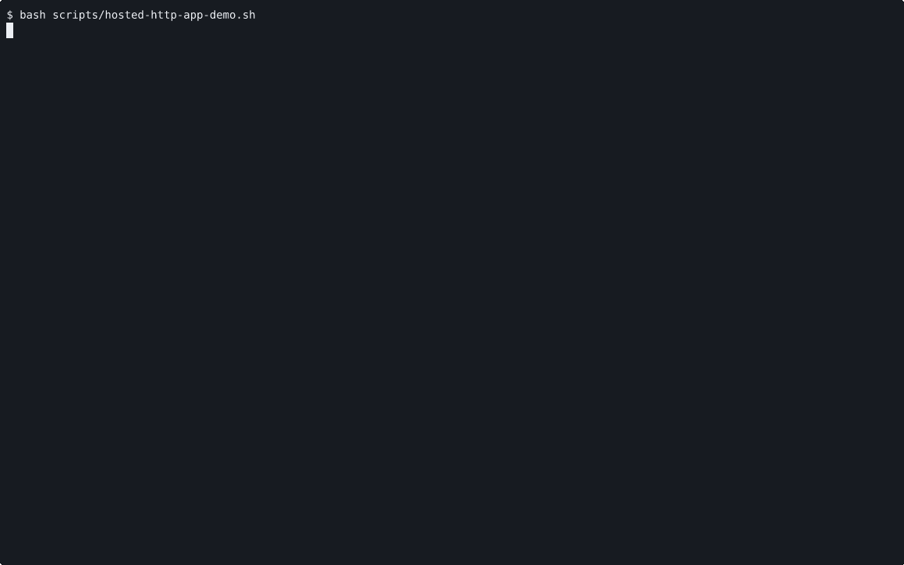

# VOYAGE REPORT: Hosted HTTP App Curl Proof

## Voyage Metadata
- **ID:** VDi3LHFpb
- **Epic:** VDi2y6gch
- **Status:** done
- **Goal:** -

## Execution Summary
**Progress:** 3/3 stories complete

## Implementation Narrative
### Wire Repo-Level Screen Surface To App Hosting Proof
- **ID:** VDi3O5dlc
- **Status:** done

#### Summary
Wire the current repo-level proof surface to show the hosted app proof as the
primary operator-facing evidence for this mission, using
`scripts/hosted-http-app-demo.sh` as the runnable workflow and
`scripts/render-hosted-http-app-proof.sh` as the recording path.

#### Acceptance Criteria
- [x] [SRS-03/AC-01] The current repo-level proof entrypoint surfaces the canonical hosted app proof workflow, including the runnable proof path and the recorded artifact, as the primary evidence for this slice. <!-- [SRS-03/AC-01] verify: bash -lc 'cd /home/alex/workspace/spoke-sh/port && ./scripts/render-hosted-http-app-proof.sh .keel/stories/VDi3O5dlc/EVIDENCE >/dev/null && bash scripts/mission-report.sh VDi2jvg4P', proof: ac-1.log -->
- [x] [SRS-NFR-01/AC-01] The story records a human-reviewable artifact for the canonical hosted app proof through the repository proof system. <!-- [SRS-NFR-01/AC-01] verify: bash -lc 'cd /home/alex/workspace/spoke-sh/port && ./scripts/render-hosted-http-app-proof.sh .keel/stories/VDi3O5dlc/EVIDENCE', proof: ac-2.gif -->

#### Verified Evidence
- [ac-1.log](../../../../stories/VDi3O5dlc/EVIDENCE/ac-1.log)

- [hosted-http-app-workflow.cast](../../../../stories/VDi3O5dlc/EVIDENCE/hosted-http-app-workflow.cast)

### Publish App Hosting Proof Contract And Boundaries
- **ID:** VDi3O6vld
- **Status:** done

#### Summary
Publish the canonical app-hosting proof contract, prerequisites, and explicit
boundaries so the first proof slice does not imply broader hosted guarantees
than Port currently ships.

#### Acceptance Criteria
- [x] [SRS-04/AC-01] README and focused docs describe the canonical hosted app proof path, its prerequisites, and its relationship to the current repo-level proof entrypoint. <!-- [SRS-04/AC-01] verify: bash -lc 'cd /home/alex/workspace/spoke-sh/port && rg -n "just mission|scripts/hosted-http-app-demo.sh|scripts/render-hosted-http-app-proof.sh|PORT_DEMO_TOKEN|repo-level review surface" README.md docs/operators.md', proof: ac-1.log -->
- [x] [SRS-04/AC-02] The published boundaries keep future `screen` naming work and future `atxt` recorder migration explicit as follow-on work instead of implying they shipped in this slice. <!-- [SRS-04/AC-02] verify: bash -lc 'cd /home/alex/workspace/spoke-sh/port && rg -n "screen|atxt|follow-on|current repo-level entrypoint name is" README.md docs/operators.md', proof: ac-2.log -->
- [x] [SRS-NFR-01/AC-02] The docs story links the human-reviewable proof path and artifact review expectations clearly enough for a maintainer to audit the workflow without reading implementation code first. <!-- [SRS-NFR-01/AC-02] verify: bash -lc 'cd /home/alex/workspace/spoke-sh/port && rg -n "human-reviewable artifact|review surface|review artifact|just mission" README.md docs/operators.md', proof: ac-3.log -->

#### Verified Evidence
- [ac-1.log](../../../../stories/VDi3O6vld/EVIDENCE/ac-1.log)
- [ac-2.log](../../../../stories/VDi3O6vld/EVIDENCE/ac-2.log)
- [ac-3.log](../../../../stories/VDi3O6vld/EVIDENCE/ac-3.log)

### Implement Hosted HTTP App Proof Workflow
- **ID:** VDi3O7KjN
- **Status:** done

#### Summary
Implement the canonical hosted workflow that launches one minimal HTTP
application through Port, exposes it through Port, and proves success with a
host-side curl.

#### Acceptance Criteria
- [x] [SRS-01/AC-01] The canonical proof workflow starts the repo-local hosted control plane and node agent, applies one minimal hosted HTTP service through `port service apply`, and keeps hosted machine, host-group, and route context explicit. <!-- [SRS-01/AC-01] verify: manual, proof: ac-2.log -->
- [x] [SRS-02/AC-01] The workflow exposes that hosted HTTP service through `port guest forward`, and a host-side `curl` returns the expected application payload. <!-- [SRS-02/AC-01] verify: manual, proof: ac-4.log -->
- [x] [SRS-NFR-02/AC-01] Existing hosted service and hosted guest-forward behavior remains intact outside the new canonical app-hosting proof path. <!-- [SRS-NFR-02/AC-01] verify: manual, proof: ac-6.log -->

#### Verified Evidence
- [ac-2.log](../../../../stories/VDi3O7KjN/EVIDENCE/ac-2.log)
- [ac-4.log](../../../../stories/VDi3O7KjN/EVIDENCE/ac-4.log)
- [ac-6.log](../../../../stories/VDi3O7KjN/EVIDENCE/ac-6.log)

