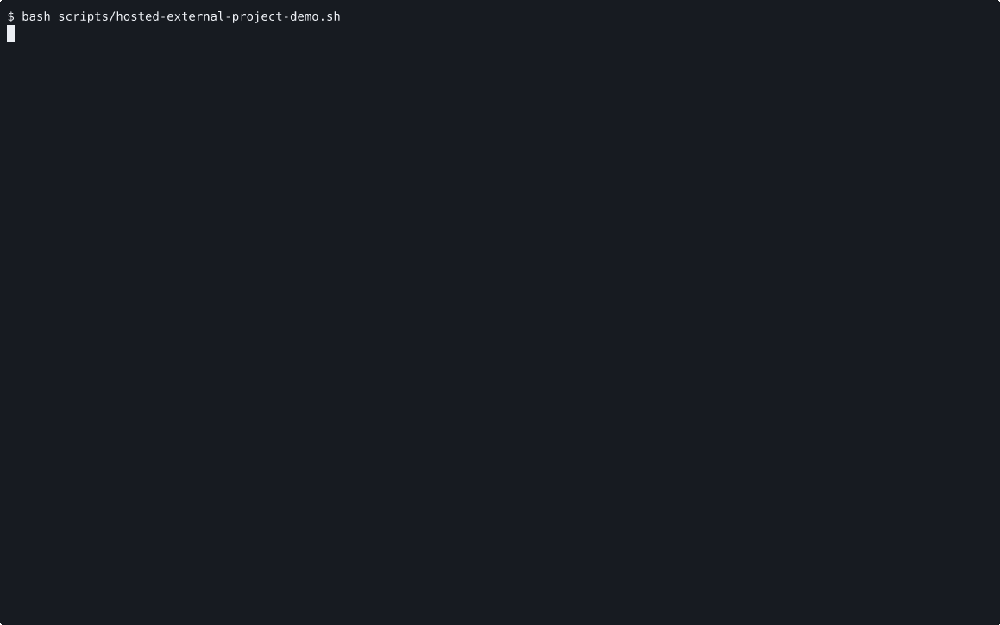

# VOYAGE REPORT: Hosted External Project Deployment Proof

## Voyage Metadata
- **ID:** VEyjdNXnp
- **Epic:** VEyjUL2Zr
- **Status:** done
- **Goal:** -

## Execution Summary
**Progress:** 3/3 stories complete

## Implementation Narrative
### Publish External Project Deployment Contract And Boundaries
- **ID:** VEyjdJhne
- **Status:** done

#### Summary
Publish the canonical external-project deployment workflow, its prerequisites,
and the boundary between this slice and future app-bundle work.

#### Acceptance Criteria
- [x] [SRS-04/AC-01] README and operator-facing docs publish the canonical external-project deployment workflow, prerequisites, command path, and proof-review path. <!-- [SRS-04/AC-01] verify: manual, proof: ac-1.log -->
- [x] [SRS-04/AC-02] Docs keep the boundary explicit that this slice stages and runs one external static-site project snapshot through shipped hosted primitives and does not yet ship an app bundle artifact contract or app bundle service runtime. <!-- [SRS-04/AC-02] verify: manual, proof: ac-2.log -->

#### Verified Evidence
- [ac-1.log](../../../../stories/VEyjdJhne/EVIDENCE/ac-1.log)
- [ac-2.log](../../../../stories/VEyjdJhne/EVIDENCE/ac-2.log)

### Wire Repo-Level Mission Surface To External Project Deployment Proof
- **ID:** VEyjdN0nf
- **Status:** done

#### Summary
Wire the repo-level proof surface to the new external-project deployment
workflow so maintainers can review the runnable path and artifact from one
place.

#### Acceptance Criteria
- [x] [SRS-03/AC-01] The current repo-level proof entrypoint surfaces the canonical external-project deployment workflow, including the runnable proof path and the recorded artifact, as the primary operator-facing evidence for this slice. <!-- [SRS-03/AC-01] verify: manual, proof: ac-2.log -->
- [x] [SRS-NFR-01/AC-01] A renderer-backed human-reviewable artifact is generated from the canonical external-project deployment workflow and linked through mission evidence. <!-- [SRS-NFR-01/AC-01] verify: manual, proof: ac-3.log -->

#### Verified Evidence
- [ac-2.log](../../../../stories/VEyjdN0nf/EVIDENCE/ac-2.log)

- [ac-3.log](../../../../stories/VEyjdN0nf/EVIDENCE/ac-3.log)
- [external-project-workflow.cast](../../../../stories/VEyjdN0nf/EVIDENCE/external-project-workflow.cast)

### Implement Hosted External Project Deployment Workflow
- **ID:** VEyjdNRno
- **Status:** done

#### Summary
Implement the canonical hosted workflow that stages one external project
snapshot into hosted compute, runs it through Port, and proves success with a
host-side curl.

#### Acceptance Criteria
- [x] [SRS-01/AC-01] The canonical proof workflow starts the repo-local hosted control plane and node agent, stages one external static-site project snapshot into hosted compute through `port guest copy` plus any minimal setup step, and keeps hosted machine, host-group, and route context explicit. <!-- [SRS-01/AC-01] verify: manual, proof: ac-1.log -->
- [x] [SRS-02/AC-01] The workflow starts that staged project through `port service apply`, exposes it through `port guest forward`, and a host-side `curl` returns the expected payload from the staged project bytes. <!-- [SRS-02/AC-01] verify: manual, proof: ac-2.log -->
- [x] [SRS-NFR-02/AC-01] Existing hosted `guest copy`, `service`, and `guest forward` behavior remains intact outside the new canonical external-project proof path. <!-- [SRS-NFR-02/AC-01] verify: manual, proof: ac-3.log -->

#### Verified Evidence
- [ac-1.log](../../../../stories/VEyjdNRno/EVIDENCE/ac-1.log)
- [ac-2.log](../../../../stories/VEyjdNRno/EVIDENCE/ac-2.log)
- [ac-3.log](../../../../stories/VEyjdNRno/EVIDENCE/ac-3.log)

