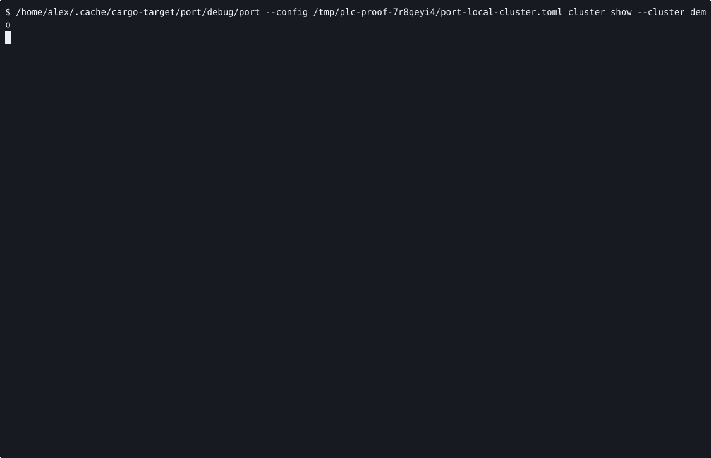

# VOYAGE REPORT: Plan Single-Node Local Cluster Surface

## Voyage Metadata
- **ID:** VFDk8fdnG
- **Epic:** VFDhlRjOf
- **Status:** done
- **Goal:** -

## Execution Summary
**Progress:** 4/4 stories complete

## Implementation Narrative
### Add Cluster CLI And Config Contract
- **ID:** VFDk8fqnH
- **Status:** done

#### Summary
Introduce the first named cluster-facing Port surface and local cluster contract
so operators stop assembling the local K3s workflow from raw `machine` and
`guest exec` steps.

#### Acceptance Criteria
- [x] [SRS-01/AC-01] Port exposes a named cluster-facing surface for the first local K3s lane and fails fast on unsupported multi-node, hosted, or AWS requests in this slice. <!-- verify: manual, SRS-01, proof: ac-1.log-->
- [x] [SRS-NFR-01/AC-02] Existing `machine`, `guest`, `service`, and hosted-K3s primitives remain available as underlying implementation substrate without silent regressions. <!-- verify: manual, SRS-NFR-01, proof: ac-2.log-->

#### Verified Evidence
- [ac-1.log](../../../../stories/VFDk8fqnH/EVIDENCE/ac-1.log)
- [ac-2.log](../../../../stories/VFDk8fqnH/EVIDENCE/ac-2.log)

### Stage Offline K3s Artifacts And Guest Profile
- **ID:** VFDk8gGoC
- **Status:** done

#### Summary
Make the first local cluster bootstrap path Port-owned by staging K3s inputs and
the required guest runtime dependencies without relying on guest-side live
network fetches.

#### Acceptance Criteria
- [x] [SRS-02/AC-01] The canonical local cluster bootstrap path uses Port-owned artifact staging or a kube-ready guest profile and does not rely on guest-side `curl https://get.k3s.io`. <!-- verify: manual, SRS-02, proof: ac-1.log-->
- [x] [SRS-NFR-02/AC-02] Repo-local verification proves the staged inputs and guest profile are sufficient for the first local bootstrap slice. <!-- verify: manual, SRS-NFR-02, proof: ac-2.log-->

#### Implementation Insights
- **VFDUWw5P4: Local guest-agent execs need guest-root-relative paths**
  - Insight: The fake local guest-agent resolves copy paths against the guest root, but exec commands are not chrooted. To keep repo-local tests aligned with real-guest semantics, run execs with `cwd = "/"` and use guest-root-relative paths like `opt/...` instead of host-absolute `/opt/...` paths.
  - Suggested Action: When adding guest exec proofs or runtime helpers for local harnesses, strip the leading slash from guest paths for the shell command and set the exec cwd to guest `/`.
  - Applies To: `crates/port-runtime/src/lib.rs`, `crates/port-cli/tests/*`, local guest-agent harnesses
  - Category: testing

#### Verified Evidence
- [ac-1.log](../../../../stories/VFDk8gGoC/EVIDENCE/ac-1.log)
- [ac-2.log](../../../../stories/VFDk8gGoC/EVIDENCE/ac-2.log)

### Implement Cluster Lifecycle Health And Kubeconfig Surfaces
- **ID:** VFDk8gRoD
- **Status:** done

#### Summary
Implement the first cluster lifecycle surface so Port can bring a local K3s
cluster up, report whether it is healthy, return kubeconfig directly, and tear
it down without infra-side choreography.

#### Acceptance Criteria
- [x] [SRS-03/AC-01] Port provides cluster lifecycle and access behavior for the first local cluster without manual API forwarding or kubeconfig rewriting outside Port. <!-- verify: manual, SRS-03, proof: ac-1.log-->
- [x] [SRS-NFR-03/AC-02] Cluster-health output clearly distinguishes Port-owned cluster readiness from later downstream bootstrap or networking work. <!-- verify: manual, SRS-NFR-03, proof: ac-2.log-->

#### Implementation Insights
- **VFDmLq9xQ: Firecracker test doubles must preserve launch argv**
  - Insight: Port classifies local Firecracker processes by inspecting live argv for both `firecracker` and `--id <machine>`, so a fake helper that `exec`s into another binary can make a healthy test process look stale.
  - Suggested Action: Keep fake Firecracker helpers running under a command line that still includes the `firecracker` script path and launch args, or update the test double explicitly when machine-status matching changes.
  - Applies To: crates/port-runtime/src/lib.rs; crates/port-cli/tests/machine_commands.rs
  - Category: testing

#### Verified Evidence
- [ac-1.log](../../../../stories/VFDk8gRoD/EVIDENCE/ac-1.log)
- [ac-2.log](../../../../stories/VFDk8gRoD/EVIDENCE/ac-2.log)

### Publish Cluster Operator Contract And Infra Handoff Proof
- **ID:** VFDk8ggoV
- **Status:** done

#### Summary
Publish the new local cluster operator contract, make the thin downstream infra
handoff explicit, and record a human-reviewable proof for the first cluster
workflow.

#### Acceptance Criteria
- [x] [SRS-04/AC-01] Docs and help publish the thin infra handoff and remove raw machine or guest choreography as the blessed cluster workflow. <!-- [SRS-04/AC-01] verify: nix develop --command bash -lc 'cd /home/alex/workspace/spoke-sh/port && cargo run -q -p port-cli -- --help | rg -n "cluster show --cluster demo|cluster up --cluster demo|cluster kubeconfig --cluster demo" && rg -n "Local cluster first slice|Port owns machine launch|Downstream infra asks Port|not the blessed cluster workflow|cluster status is Port.s answer|cluster kubeconfig --format json|render-local-cluster-proof" README.md docs/operators.md CONFIGURATION.md && ! rg -n "Hosted Stateless K3s First Slice|curl https://get.k3s.io" README.md docs/operators.md CONFIGURATION.md', proof: ac-1.log -->
- [x] [SRS-NFR-02/AC-02] The story records one human-reviewable proof artifact for the canonical local cluster workflow. <!-- [SRS-NFR-02/AC-02] verify: nix develop --command bash -lc 'cd /home/alex/workspace/spoke-sh/port && ./scripts/render-local-cluster-proof.sh .keel/stories/VFDk8ggoV/EVIDENCE', proof: ac-2.gif -->

#### Implementation Insights
- **VFG3hLr2M: Proof scripts must honor Cargo target indirection**
  - Insight: The dev shell can redirect Cargo outputs through `CARGO_TARGET_DIR`, so proof scripts that hardcode `./target/debug/...` can execute stale binaries even after a successful build.
  - Suggested Action: Resolve built binary paths from `$CARGO_TARGET_DIR` with a fallback to the repo `target` directory, or use `cargo run` when the executable path must follow the active shell contract.
  - Applies To: `scripts/render-*.sh`
  - Category: testing

#### Verified Evidence
- [ac-1.log](../../../../stories/VFDk8ggoV/EVIDENCE/ac-1.log)

- [ac-2.log](../../../../stories/VFDk8ggoV/EVIDENCE/ac-2.log)
- [local-cluster-workflow.cast](../../../../stories/VFDk8ggoV/EVIDENCE/local-cluster-workflow.cast)

