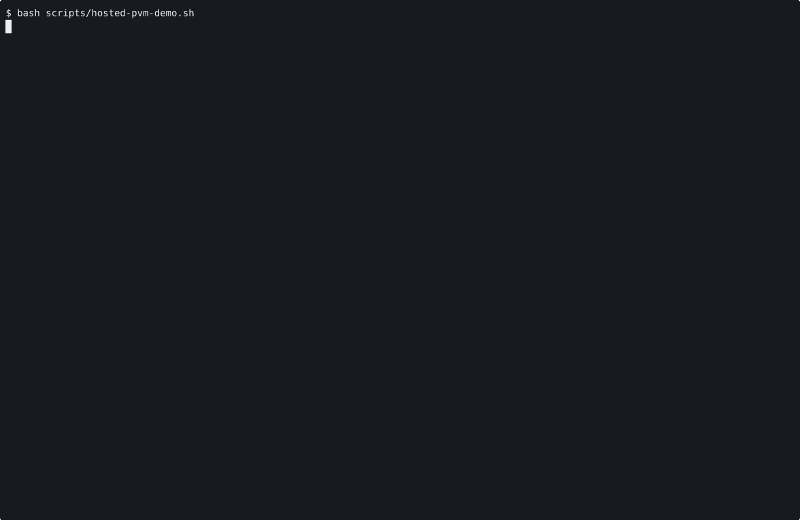

# VOYAGE REPORT: Cloud Aws PVM Runtime Proof

## Voyage Metadata
- **ID:** VFgclbQzC
- **Epic:** VFgcPDfEj
- **Status:** done
- **Goal:** -

## Execution Summary
**Progress:** 2/2 stories complete

## Implementation Narrative
### Publish Hosted AWS PVM Operator Proof
- **ID:** VFgcoUoUd
- **Status:** done

#### Summary
Publish the canonical operator proof for the hosted AWS PVM lane so Port shows
how to prepare the node and then launch, inspect, and stop `cloud-aws` on the
live hosted runtime path.

#### Acceptance Criteria
- [x] [SRS-03/AC-01] Port publishes a canonical hosted AWS PVM proof that runs `prepare-pvm-node` plus `machine launch`, `status`, and `stop` for `cloud-aws` on a prepared x86_64 AWS node. <!-- [SRS-03/AC-01] verify: bash -lc 'cd /home/alex/workspace/spoke-sh/port && ./scripts/render-hosted-pvm-proof.sh .keel/stories/VFgcoUoUd/EVIDENCE', proof: ac-1.gif -->
- [x] [SRS-NFR-02/AC-02] The proof and operator-facing docs keep the scope boundary explicit: x86_64 AWS hosted PVM only, with provider-aware prerequisites and failure expectations. <!-- [SRS-NFR-02/AC-02] verify: bash -lc 'cd /home/alex/workspace/spoke-sh/port && rg -n "hosted-pvm-demo|render-hosted-pvm-proof|x86_64|AWS|aarch64|GCP|Azure|prepare-pvm-node" README.md docs/operators.md docs/hosted.md docs/pvm.md docs/cloud.md', proof: ac-2.log -->

#### Verified Evidence

- [ac-1.log](../../../../stories/VFgcoUoUd/EVIDENCE/ac-1.log)
- [ac-2.log](../../../../stories/VFgcoUoUd/EVIDENCE/ac-2.log)
- [hosted-pvm-workflow.cast](../../../../stories/VFgcoUoUd/EVIDENCE/hosted-pvm-workflow.cast)

### Route Cloud Aws PVM Launch Through Prepared AWS Node
- **ID:** VFgcpTciv
- **Status:** done

#### Summary
Route canonical `cloud-aws` lifecycle commands through the live hosted
control-plane and node-agent path once an AWS node is prepared for the PVM
lane, and keep failures provider-aware when that readiness is missing.

#### Acceptance Criteria
- [x] [SRS-01/AC-01] `port machine launch --machine cloud-aws`, `status`, and `stop` succeed through the live hosted control-plane and node-agent path when an x86_64 AWS node advertises ready PVM preparation. <!-- [SRS-01/AC-01] verify: manual, proof: ac-1.log -->
- [x] [SRS-02/AC-02] If the AWS hosted PVM lane is missing prerequisites or still planned, Port fails with actionable `cloud-aws` guidance and does not fall back to the standard Firecracker/KVM lane. <!-- [SRS-02/AC-02] verify: manual, proof: ac-2.log -->

#### Verified Evidence
- [ac-1.log](../../../../stories/VFgcpTciv/EVIDENCE/ac-1.log)
- [ac-2.log](../../../../stories/VFgcpTciv/EVIDENCE/ac-2.log)

