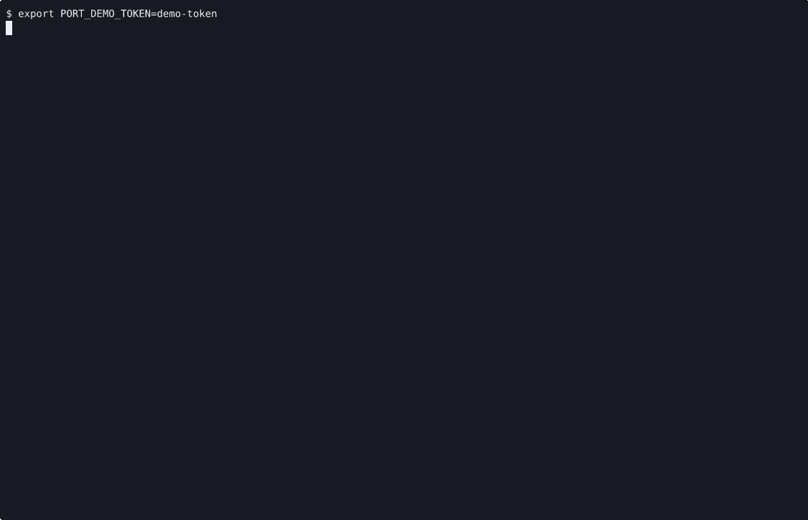

# VOYAGE REPORT: Seal Managed Hosted K3s Ownership

## Voyage Metadata
- **ID:** VGcghwZrb
- **Epic:** VGcgU9T57
- **Status:** done
- **Goal:** -

## Execution Summary
**Progress:** 3/3 stories complete

## Implementation Narrative
### Persist Hosted Placement And Service Records Across Reuse
- **ID:** VGcgtBvDE
- **Status:** done

#### Summary
Make hosted placement and managed-service records durable across reuse so
status, recovery, and downstream inspection do not depend on transient launch
state.

#### Acceptance Criteria
- [x] [SRS-01/AC-01] Hosted placement and managed-service records persist durably enough for reuse and service status to survive beyond launch-time state. <!-- verify: bash -lc 'cd /home/alex/workspace/spoke-sh/port && cargo test -q -p port-runtime hosted_k3s_bootstrap_persists_placement_and_service_records', SRS-01:start:end, proof: ac-1.log-->
- [x] [SRS-NFR-01/AC-02] The persistence contract remains explicit in runtime artifacts and service-status surfaces. <!-- verify: bash -lc 'cd /home/alex/workspace/spoke-sh/port && cargo test -q -p port-runtime hosted_k3s_service_status_survives_from_persisted_records_after_launch', SRS-NFR-01:start:end, proof: ac-2.log-->

#### Verified Evidence
- [ac-1.log](../../../../stories/VGcgtBvDE/EVIDENCE/ac-1.log)
- [ac-2.log](../../../../stories/VGcgtBvDE/EVIDENCE/ac-2.log)

### Enforce Managed Service Ownership For Hosted K3s
- **ID:** VGcgtDfDT
- **Status:** done

#### Summary
Remove legacy detached hosted K3s paths from the valid runtime contract so
hosted workers and servers exist under managed Port service ownership only.

#### Acceptance Criteria
- [x] [SRS-02/AC-01] Port rejects, replaces, or otherwise eliminates legacy detached hosted K3s paths in favor of managed-service ownership. <!-- verify: manual, SRS-02:start:end, proof: ac-1.log -->
- [x] [SRS-NFR-01/AC-02] Managed-service ownership remains explicit in runtime artifacts and service status after the cutover. <!-- verify: manual, SRS-NFR-01:start:end, proof: ac-2.gif -->

#### Implementation Insights
- **VGct0mwbD: Hosted Proof Harnesses Need Isolated Control-Plane State**
  - Insight: Hosted proof harnesses can collide with existing `.port/hosted/<control-plane>` state and stale binary assumptions unless they use a unique temporary control-plane name and resolve the CLI through the active `CARGO_TARGET_DIR`.
  - Suggested Action: Give each hosted proof run a unique control-plane name and derive the CLI binary path from `CARGO_TARGET_DIR` before starting long-lived harness processes.
  - Applies To: `scripts/render-hosted-*.sh`
  - Category: testing

#### Verified Evidence
- [ac-1.log](../../../../stories/VGcgtDfDT/EVIDENCE/ac-1.log)

- [ac-2.log](../../../../stories/VGcgtDfDT/EVIDENCE/ac-2.log)
- [hosted-k3s-workflow.cast](../../../../stories/VGcgtDfDT/EVIDENCE/hosted-k3s-workflow.cast)

### Record Hosted Worker Stability Soak Proof
- **ID:** VGcgtFI9v
- **Status:** done

#### Summary
Record reviewable proof that hosted workers remain healthy or recover correctly
across the observed 60-90 minute drift window.

#### Acceptance Criteria
- [x] [SRS-03/AC-01] Port records reviewable proof that hosted workers remain healthy or recover correctly across the targeted drift window. <!-- verify: manual, SRS-03:start:end, proof: ac-1.gif -->
- [x] [SRS-NFR-02/AC-02] The stability proof remains reviewable without workstation-local lore. <!-- verify: manual, SRS-NFR-02:start:end, proof: ac-2.log -->

#### Implementation Insights
- **VGct92Y9v: Hosted Proof Harnesses Must Seed Registrations Before Control-Plane Start**
  - Insight: `control-plane serve` loads registered node state into memory at startup, so proof harnesses that hand-author registration state must write it before starting the control plane or the route resolver will treat every candidate node as missing.
  - Suggested Action: Reserve node bind addresses first, persist registered-node state with current freshness timestamps, then start `control-plane serve` and the node-agent processes.
  - Applies To: `scripts/render-hosted-*.sh`, hosted control-plane proof harnesses
  - Category: testing

#### Verified Evidence

- [ac-1.log](../../../../stories/VGcgtFI9v/EVIDENCE/ac-1.log)
- [ac-2.log](../../../../stories/VGcgtFI9v/EVIDENCE/ac-2.log)
- [hosted-k3s-ha-failover-workflow.cast](../../../../stories/VGcgtFI9v/EVIDENCE/hosted-k3s-ha-failover-workflow.cast)

